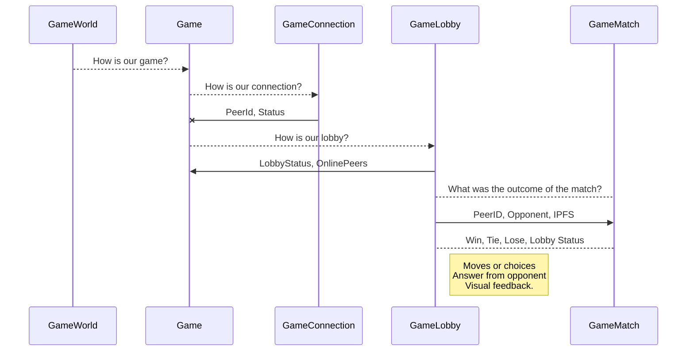
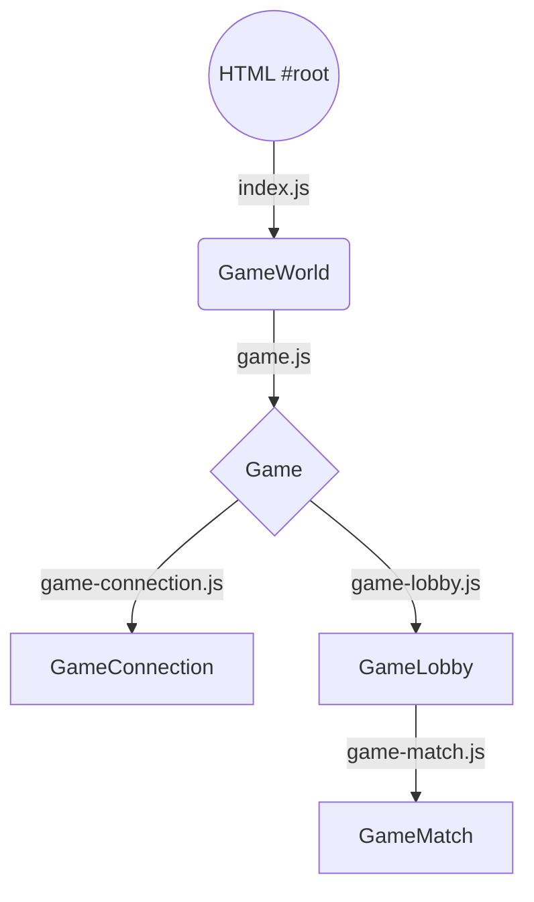

# RPS - Faircoin
### A Rock, Paper and Scissors multiplayer game!

Creating a Rock-Paper-Scissors's game shouldn't pose a *problem*, right? **WRONG**


# Files

The files follows the usual react-create-app structure.
```
JanKenPon-construction
├── package.json
├── public
│   ├── favicon.ico
│   └── index.html
└── src
    ├── components
    │   ├── game-connection.js
    │   ├── game-lobby.js
    │   ├── game-match.js
    │   ├── game.js
    │   └── styles.css
    ├── index.js
    └── media
        ├── rps-loading.gif
        ├── rps-paper.png
        ├── rps-rock.png
        └── rps-scissors.png
 
```
## How to run

~~You must know by now, but well...~~ Put this within a terminal in the parent folder:
```
npm i && npm start
```

## Game. Functional Specs.

### Introduction.

Games and coding are fun! At least until mistakes and errors arise. This is a classic aproach to Rock, Paper and Scissors game, but using IPFS to communicate moves. 

### Setting up game.

First you will notice an **OFFLINE** notice that reflect the estatus of our ipfs-js, a Guaranty Trusty way to get safest connection because we are talking about *money* here. When it changes to **WAITING** means that IPFS created a node, and subscribe to our lobby channel. 

### Lobby and waiting a game.

You will see a **PeerID** field, indicating your unique id inside the game. This ID is generated by IPFS and can't be shared by others players even inside your local network, even inside your own machine system! 

Also you will see another status field, first at **CHILLING**, meaning you are relaxing on our lobby, just waiting a challenge. Other status is Challenging, that means your are connecting with other player and trying to have an old fashioned match. The las posible status is Matching, when, yeah you guess it, you are actually playing the game against an human player.

Next you will see a growing list of **ONLINE PEERS**, that catch from the lobby other players in Chilling status. Tou can select one of them, and notice that your status switch to Challenging. When the other player or you get a Challenging Call, a button on the Online Peers will change color, and the way to answer is selecting back the colored button. If the challenge was acepted, the status will change to Matching.
> **ProTip:** You can see a **basic counter** next to any Opponent ID. If someone is deaf to your call, just call anyone else

### Matching

If you don't know the game, here is a fancy guide:

| "Isn't this fun?" |Rock  |Paper|Scissors   |
|-------------------|-------|-----|-----------|
|Rock | Rock smash Rock. TIE| Rock is Wrapped by Paper. LOSE | Rock smash Scissors. WIN | 
|Paper|Paper wraps Rock. Win |Paper rub Paper. TIE | Paper is cut by Scissors. LOSE|
|Scissors  | Scissors is smashed by Rock. LOSE |Scissors cut Paper. WIN|Scissors sharpen Scissors. TIE|

> We area working in the current form of this. Please be patient with us.


# TODO

- Improve UI and some game mechanics.
- Use A-Frame WebVR instead of images.
- Create a user profile, player point, FairCoin connection, etc.
- Other client requirements.

## Team Development

- Rozgo (TEAM LEADER)
- Max (SENIOR PROGRAMMER)
- Javi
- Israel


## KaTeX

Later I can render LaTeX mathematical expressions using [KaTeX](https://khan.github.io/KaTeX/):

The *Gamma function* satisfying $\Gamma(n) = (n-1)!\quad\forall n\in\mathbb N$ is via the Euler integral

$$
\Gamma(z) = \int_0^\infty t^{z-1}e^{-t}dt\,.
$$

> You can find more information about **LaTeX** mathematical expressions [here](http://meta.math.stackexchange.com/questions/5020/mathjax-basic-tutorial-and-quick-reference).


## UML diagrams

You can render UML diagrams using [Mermaid](https://mermaidjs.github.io/). For example, this will produce a sequence diagram:



To visualize the flow with a  flow chart like this:


